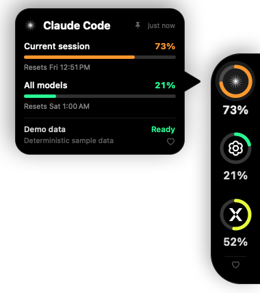
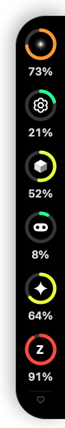
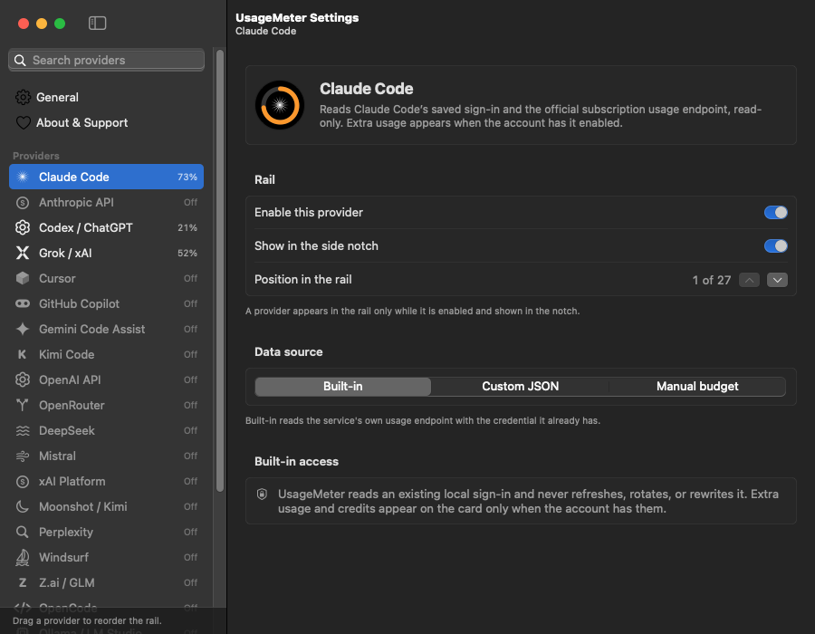
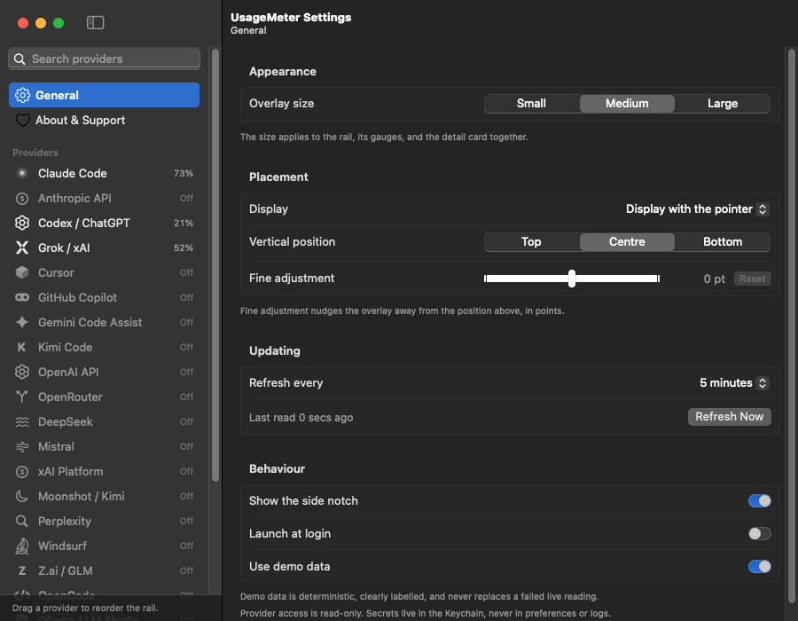
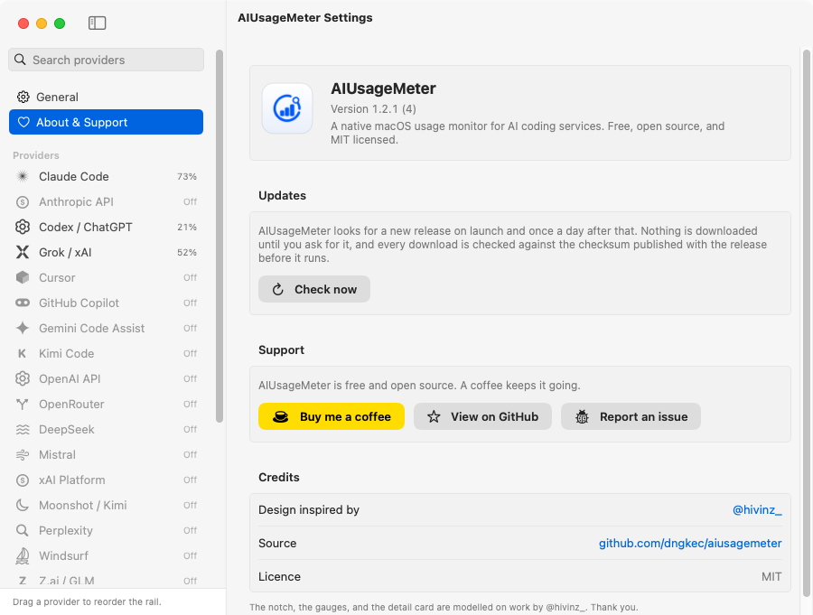

<div align="center">
  

  <h1>AIUsageMeter</h1>

  <p><strong>A native macOS and Windows usage monitor for the AI coding services you pay for.</strong></p>

  <p>
    
    
    
    
    
    <a href="https://buymeacoffee.com/dngkec"></a>
  </p>

  
</div>

AIUsageMeter shows how much of each AI coding plan or API budget you have used. It draws a black, always-on-top overlay on the right edge of a display, one gauge per provider. The original Swift/AppKit application remains the macOS implementation; Windows uses a separate native .NET 8 WPF application with the same portable models, parser behaviour, security limits, and preferences concepts.

On macOS the app is an `LSUIElement` accessory, so it has no Dock icon, and hovering the notch does not activate or focus it. A menu-bar gauge carries Refresh Now, Hide/Show Notch, Settings, the support links, and Quit.

Provider access is read-only. App-owned secrets use macOS Keychain or Windows Credential Manager, and release applications have no third-party runtime dependency.

## Install

Download the platform asset from [Releases](https://github.com/dngkec/aiusagemeter/releases):

- **macOS:** open `AIUsageMeter-<version>.dmg` and drag **AIUsageMeter** into **Applications**.
- **Windows:** run `AIUsageMeter-<version>-win-x64-setup.exe`, or the `win-arm64` build on an Arm machine. It installs for the current user, so it asks for no administrator rights, and it registers an uninstaller under Installed apps. The build is self-contained; a separate .NET installation is not required. Windows artifacts are unsigned, so SmartScreen asks you to confirm the first run.

AIUsageMeter is ad-hoc signed rather than notarised, so macOS refuses to open it on a first double-click. Right-click **AIUsageMeter.app** in Applications, choose **Open**, and confirm once; every launch after that is normal. From the terminal:

```sh
xattr -dr com.apple.quarantine /Applications/AIUsageMeter.app
```

There is no Dock icon on macOS. On either platform, look for AIUsageMeter in the menu-bar/status-tray area and at the right edge of your display.

## Build from source

For macOS, use macOS 14 or newer with Xcode or the Apple Command Line Tools and Swift 6:

```sh
./scripts/build-app.sh          # dist/AIUsageMeter.app
open dist/AIUsageMeter.app

./scripts/make-dmg.sh           # dist/AIUsageMeter-<version>.dmg
```

Build products stay under `.build/`; the packaged, ad-hoc-signed app is written to `dist/AIUsageMeter.app`. `make-dmg.sh` turns that into a drag-to-Applications disk image with a laid-out window, a background, and a volume icon; pass `--no-build` to package an app bundle you already have. The Finder arrangement is best-effort — on a machine that denies Finder automation, usually CI, the image is still produced and valid, just not laid out.

For Windows, install the .NET 8 SDK and Visual Studio 2022 Build Tools with the .NET desktop workload, or use the `windows-latest` CI job:

```powershell
dotnet restore AIUsageMeter.Windows.sln
./scripts/test-windows.ps1 -Configuration Release
dotnet build src/AIUsageMeter.Windows/AIUsageMeter.Windows.csproj -c Release -r win-x64
./scripts/package-windows.ps1 -Runtime win-x64
```

`package-windows.ps1` publishes a self-contained single-file WPF application, compiles the installer from `scripts/windows-installer.iss`, and writes its SHA-256 checksum under `dist/`. It needs Inno Setup 6 (`winget install JRSoftware.InnoSetup`). Both x64 and Arm64 are produced for tagged releases.

To launch with deterministic demo data and the first card expanded:

```sh
./scripts/run-demo.sh
```

`scripts/capture-demo.sh` renders the overlay to `docs/aiusagemeter-demo.png` without needing screen-recording permission, and takes an output path as an optional first argument. `AIUSAGEMETER_DEMO_PROVIDERS` picks which catalog entries appear, `AIUSAGEMETER_DEMO_EXPANDED=0` leaves every card closed, `AIUSAGEMETER_SNAPSHOT_TARGET=settings` captures the Settings window instead of the notch, and `AIUSAGEMETER_SNAPSHOT_PANE=about|general|<provider id>` chooses which pane it opens on. Every screenshot in this README is produced that way, from demo data, so none of them shows a real account:

```sh
AIUSAGEMETER_DEMO_PROVIDERS=claude,codex,grok \
  ./scripts/capture-demo.sh docs/aiusagemeter-demo.png
AIUSAGEMETER_DEMO_EXPANDED=0 AIUSAGEMETER_DEMO_PROVIDERS=claude,codex,cursor,copilot,gemini,zai \
  ./scripts/capture-demo.sh docs/aiusagemeter-rail.png
AIUSAGEMETER_SNAPSHOT_TARGET=settings AIUSAGEMETER_SNAPSHOT_PANE=claude \
  ./scripts/capture-demo.sh docs/aiusagemeter-settings.png
AIUSAGEMETER_SNAPSHOT_TARGET=settings AIUSAGEMETER_SNAPSHOT_PANE=general \
  ./scripts/capture-demo.sh docs/aiusagemeter-general.png
AIUSAGEMETER_SNAPSHOT_TARGET=settings AIUSAGEMETER_SNAPSHOT_PANE=about \
  ./scripts/capture-demo.sh docs/aiusagemeter-support.png
```

Park the pointer away from the overlay before a notch capture. The panel is live while it is being rendered, so a gauge under the pointer opens its own card and lands in the image.

## Interaction

<p align="center">
  
  <br>
  <sub>The rail: one gauge per provider, six of them here.</sub>
</p>

- Hover a gauge to open its detail card. The card's pointer aims at that gauge, so it is always clear which reading is on screen. Enable more providers than fit the display and the rail scrolls; cards still open beside the gauge they belong to.
- The card stays open while the pointer is on it, so its Dashboard and Settings links are reachable.
- Click a gauge to pin or unpin its card. Click away or press Escape to close a pinned card. Escape belongs to Settings while that window is focused.
- During a refresh each value arc dims and a white arc sweeps around it while the previous reading stays on screen. Percentages roll rather than jump.
- The menu-bar gauge averages the subscriptions the notch shows, so one exhausted quota does not make the whole set look spent. Hide a provider from the notch and it leaves the gauge, the menu, and the average with it. Its menu heads with that average and how many subscriptions are at their limit, then lists each provider, alongside the support links and the repository. The tooltip adds the highest reading.
- A heart sits at the foot of the rail and on every card. It opens Buy Me a Coffee in a browser and does nothing else.
- Reduce Motion is respected: transitions cross-fade and the refresh sweep becomes a dimmed arc. The notch stays black in both system appearances; Settings follows the system.

The Windows overlay behaves the same way, down to the spring the panel opens on. Read the notes above with two substitutions: the menu-bar gauge is a notification-area icon, and Reduce Motion is Windows' own "show animations" setting. Where macOS draws the rail in AppKit, Windows draws it in WPF from the same measurements, so the two look alike rather than merely similar.

## Settings

Open Settings with `⌘,` from the menu-bar menu or the app menu. The title bar names the window and the pane on screen, and the window's size and position are remembered between launches. Changes apply as you make them — there is nothing to save. Only the write to disk is debounced, and a change that alters a reading refetches it, so the rail and the menu-bar gauge never wait on the refresh timer.

On Windows, open Settings from the notification-area menu. It carries the same sidebar, search, provider panes, and placement controls, and it applies changes as you make them in the same way. Only the secret field has a Save button, because a key is written to Credential Manager once you have finished typing it, not on every keystroke. Launch at login is written under the current user's own `Run` key. The notification-area menu provides refresh, show/hide, provider summaries, support links, Settings, and Quit.

The sidebar lists **General**, **About & Support**, and every provider in the catalog with its current reading, or `Off` when it is disabled. Search filters the list. Drag a provider to reorder the rail, or use the right-click menu to enable, disable, or move it. Reordering is offered only when the search field is empty.

A provider pane holds:

- The reason it is not reading, when it is not — expired credential, rate limit, setup needed — beside the provider's own setup note.
- **Rail**: enable the provider, show or hide it in the notch, and move its position with the arrows under **Position in the rail**.
- **Data source**: Built-in, Custom JSON, or Manual budget.
- For a built-in source that needs a key: the monthly budget, a team or workspace ID, a region where the service has one, and the key field itself. App-owned keys are written to Keychain on macOS and Windows Credential Manager on Windows, never to preferences.

<p align="center">
  
  <br>
  <sub>A provider pane: the rail switches, the position arrows, and the data source.</sub>
</p>

**General** covers the overlay size; which display the notch is pinned to, or the display holding the pointer; vertical position and a fine adjustment of ±300 pt; how often AIUsageMeter refreshes, from 30 seconds to an hour, with a Refresh Now button and the time of the last reading; whether the notch is shown at all; launch at login; and demo data.

<p align="center">
  
  <br>
  <sub>General: overlay size, placement, refresh interval, and the demo-data switch.</sub>
</p>

**About & Support** carries the version, the support links, and the credits.

AIUsageMeter also installs a standard menu bar while it is frontmost, so Cut, Copy, Paste, Select All, and Undo work in the key fields.

## Design

The overlay is proportioned from one module, the rail width, so every measurement including type moves together. At the default Medium size:

| Element | Size |
|---|---|
| Rail | 72 pt wide, 44 pt leading corner radius, true black |
| Gauge | 46 pt with a 5 pt ring, arc drawn clockwise from twelve o'clock with round caps |
| Card | 248 pt wide, 22 pt corner radius, 26 × 30 pt pointer, 12 pt of air before the rail |
| Resting tab | 8 pt wide and 52 pt tall, inside a 24 pt pointer target |

Small and Large scale all of it by 0.86× and 1.18×. Usage colour runs from `#14FF97` through `#EDFF05` to amber and red at 50%, 70%, and 90%.

Type is SF Pro on macOS, which the system supplies. Apple does not license it for redistribution, so the Windows build embeds Inter instead — four static weights under the SIL Open Font License, credited in [THIRD_PARTY_NOTICES.md](THIRD_PARTY_NOTICES.md). Provider marks are drawn in code rather than bundled from vendors, so AIUsageMeter redistributes no third-party logo. To use official artwork, drop files into `Resources/ProviderMarks` and rebuild; see the README there. Anything not supplied keeps its drawn mark.

The overlay window is sized once per revealed session. It grows before a panel opens and shrinks only after one has closed, so no window resize runs underneath an animation.

## Provider support

The table describes the full macOS implementation. Windows currently provides built-in live connectors for Claude Code, Codex, Grok, GitHub Copilot, Gemini Code Assist, Kimi Code, Anthropic API, OpenAI API, OpenRouter, DeepSeek, Mistral, xAI Platform, Moonshot, Z.ai, and OpenCode. It discovers the corresponding CLI files read-only at `%USERPROFILE%\.claude\.credentials.json`, `.codex\auth.json`, `.grok\auth.json`, `.gemini\oauth_creds.json`, and `.kimi-code\credentials\kimi-code.json`; Copilot checks `.config\github-copilot`, `%APPDATA%\github-copilot`, `.config\gh\hosts.yml`, and `%APPDATA%\GitHub CLI\hosts.yml`. Cursor is explicitly unavailable on Windows because its credential is in `%APPDATA%\Cursor\User\globalStorage\state.vscdb` and AIUsageMeter does not ship or invoke a SQLite reader. JetBrains AI and Warp are also reported as unavailable rather than silently returning demo data. Every provider still supports Custom JSON and Manual Budget on Windows.

| Provider | Built-in live source | Credential behaviour |
|---|---|---|
| Claude Code | `GET api.anthropic.com/api/oauth/usage` | Reads the Claude Code Keychain item or `~/.claude/.credentials.json`; never refreshes or rewrites it. Extra usage is shown only when the account has it enabled. |
| Anthropic API | Organisation cost report, normalised to a monthly USD budget | Admin key is stored only in AIUsageMeter's Keychain item. |
| Codex / ChatGPT | `GET chatgpt.com/backend-api/wham/usage` | Reads `~/.codex/auth.json`, including the account header when present; never modifies it. Credits appear when the response includes them. |
| Grok / xAI | `cli-chat-proxy.grok.com/v1/billing`, both shapes | Reads `~/.grok/auth.json`; never modifies it. The `?format=credits` view carries the subscription quota, so it is read first; credit balance is shown when present. |
| Cursor | `cursor.com/api/usage-summary`, then the per-user request count | Reads `state.vscdb` with `/usr/bin/sqlite3 -readonly`; no token is placed on the process command line. On-demand spend appears when enabled. |
| GitHub Copilot | `GET api.github.com/copilot_internal/user` | Uses an existing Copilot or GitHub CLI token store; never writes to one. |
| Gemini Code Assist | Code Assist load/quota endpoints | Uses only a valid `~/.gemini/oauth_creds.json` access token. Reopen Gemini CLI after expiry. |
| Kimi Code | `GET api.kimi.com/coding/v1/usages` | Uses only a valid `~/.kimi-code/credentials/kimi-code.json` access token. Reopen Kimi Code after expiry. |
| OpenAI API | Organisation cost report, normalised to a monthly USD budget | Admin key is stored only in AIUsageMeter's Keychain item. |
| OpenRouter | `GET /api/v1/credits` and `GET /api/v1/key` | API key is stored only in AIUsageMeter's Keychain item. Credits and a key cap are shown when the account has them. |
| DeepSeek | `GET api.deepseek.com/user/balance` | API key is stored only in AIUsageMeter's Keychain item. Remaining credits are shown against your monthly budget. |
| Mistral | `GET /v1/admin/spend-limit` | Admin key is stored only in AIUsageMeter's Keychain item. |
| xAI Platform | `GET management-api.x.ai/v1/billing/teams/{team}/prepaid/balance` | Management key is stored only in AIUsageMeter's Keychain item; the team ID goes in preferences. Inference keys are rejected by the API. |
| Moonshot / Kimi | `GET /v1/users/me/balance`, on the host for the chosen region | API key is stored only in AIUsageMeter's Keychain item. Distinct from Kimi Code: different account, different key. |
| Z.ai / GLM | `GET /api/monitor/usage/quota/limit`, on the host for the chosen region | API key is stored only in AIUsageMeter's Keychain item. Coding Plan windows are listed shortest-first; the MCP lane is listed separately. |
| OpenCode | `GET opencode.ai/zen/go/v1/usage` | API key is stored only in AIUsageMeter's Keychain item. Resets are reported as a countdown, resolved against the time of the reading. |
| Warp | `POST app.warp.dev/graphql/v2?op=GetRequestLimitInfo` | API key is stored only in AIUsageMeter's Keychain item. A plan with no request limit reports that rather than drawing an empty gauge. |
| JetBrains AI | The quota the IDE itself wrote to `AIAssistantQuotaManager2.xml` | No network request and no credential. The most recently updated IDE that has written a quota wins. |

Perplexity, Windsurf, Ollama/LM Studio, Amp, Kilo, Augment, Devin, Antigravity, and Custom are in the catalog without a built-in source. AIUsageMeter does not guess at undocumented private APIs: a service that publishes usage only to its own web app is left to Custom JSON rather than importing browser cookies. Every catalog entry supports:

- **Custom JSON**: GET or POST, HTTPS only (localhost HTTP is permitted), an optional bearer or API-key header secret in the platform credential vault, dot-separated JSON paths for percentage or used/limit/reset, and an optional dashboard URL. Extra usage and credits appear when the payload includes them.
- **Manual budget**: explicit used, limit, and reset date.

Demo data is deterministic and labelled `DEMO DATA`. It is never substituted for a failed live reading.

## Privacy and security

- Provider access is read-only. AIUsageMeter does not refresh or rotate shared CLI OAuth tokens.
- Secrets the app owns are stored in macOS Keychain or Windows Credential Manager under `AIUsageMeter/*`, never in the preferences file or a log.
- Preferences are an atomic JSON file at `~/Library/Application Support/AIUsageMeter/preferences.json` on macOS or `%LOCALAPPDATA%\AIUsageMeter\preferences.json` on Windows. It holds configuration and no secrets.
- Requests use platform HTTP stacks with system TLS, no cookie store, 15-second connection/request and 25-second total timeouts, redirects disabled on Windows, explicit endpoints, and a 1–2 MB streaming response cap.
- Refreshes run concurrently and are cancellable. A failure is isolated to its own provider.
- Credentials and provider response bodies are never printed.
- There are no Node or Python runtime dependencies and no third-party runtime frameworks.

Reading a discovered credential can raise a normal macOS Keychain prompt. On Windows, shared CLI files are only opened read-only with bounded size and are never rewritten. A denied or unavailable credential leaves that provider in Setup Needed without affecting the others.

## Verifying a build

```sh
swift build -c release
./scripts/build-app.sh
pwsh ./scripts/test-windows.ps1 -Configuration Release
dotnet build src/AIUsageMeter.Windows/AIUsageMeter.Windows.csproj -c Release -r win-x64
```

The release build is compiled with `-warnings-as-errors`, and the packaging script lints the bundle's `Info.plist` and verifies its signature with `codesign --deep --strict`.

`test-windows.ps1` runs the published .NET suite, `AIUsageMeter.Core.Tests`, which covers representative parsers, preferences migration, URL policy, overlay geometry, bounded network failures, and demo labelling. It launches the test executable directly, because `dotnet test` on the .NET 10 SDK can report `Zero tests ran` instead of running them. The more extensive Swift fixture suite remains in the maintainer's working copy; `Package.swift` declares it only when `Tests/` is present. Windows CI is authoritative for runtime-target compilation and packaging. A macOS cross-build validates C# and WPF markup but is not a Windows runtime test.

## Troubleshooting

- **Windows Setup Needed:** open the named CLI and sign in, then Refresh. AIUsageMeter checks only the bounded, read-only paths listed under Provider support; it does not search browser data or refresh a CLI token.
- **Windows overlay on the wrong display:** choose a connected display in Settings. If a saved display is disconnected, the Windows app safely falls back to the display containing the pointer.
- **Windows launch at login starts the wrong copy:** this happens when an older copy was run from a folder rather than installed. Uninstall under Installed apps, run the installer, then enable the option again.
- **Windows SmartScreen:** the installer is currently unsigned. Verify the SHA-256 file shipped beside it before confirming the first run.

- **Setup Needed:** open the provider's CLI or app and sign in, then Refresh. For a catalog-only provider, choose Custom JSON or Manual budget.
- **Expired Gemini or Kimi:** reopen the corresponding CLI. AIUsageMeter will not refresh a token it does not own.
- **Cursor unavailable:** quit and reopen Cursor once, and confirm its account is signed in. AIUsageMeter reads the database read-only.
- **Notch on the wrong display:** choose a named display in Settings. "Display with the pointer" follows the display containing the pointer whenever the panel is repositioned. A display that has been unplugged is still listed, as "Display not connected", until you pick another.
- **Launch at login fails:** run the packaged app from `/Applications`. ServiceManagement rejects ad-hoc development bundles on some systems.
- **Demo snapshot:** `scripts/capture-demo.sh` renders the app's own panel to `docs/aiusagemeter-demo.png` and does not need Screen Recording permission.

## Support the project

AIUsageMeter is free and open source and will stay that way. If it saves you a trip to a billing dashboard, you can [buy me a coffee](https://buymeacoffee.com/dngkec). Starring the repository and reporting what breaks help too.



Every support link opens in a browser. They live in one place,
[`Sources/AIUsageMeterCore/Support.swift`](Sources/AIUsageMeterCore/Support.swift),
and the app refuses to open a URL that is not one of them.

## Credits

- **Design** — inspired by the work of [@hivinz_](https://x.com/hivinz_), with thanks. The notch, the gauges, the detail card and its pointer, and the icon all take after their work. Please keep the credit if you fork this.
- **Code** — [@dngkec](https://github.com/dngkec) and [contributors](https://github.com/dngkec/aiusagemeter/graphs/contributors).
- Endpoint-shape research is credited in [THIRD_PARTY_NOTICES.md](THIRD_PARTY_NOTICES.md).

## Contributing

Read [CONTRIBUTING.md](CONTRIBUTING.md) first: it lists the five constraints the app is built around and how to add a provider. Security issues go through [SECURITY.md](SECURITY.md) rather than a public issue.

## License

MIT. See [LICENSE](LICENSE) and [THIRD_PARTY_NOTICES.md](THIRD_PARTY_NOTICES.md).
