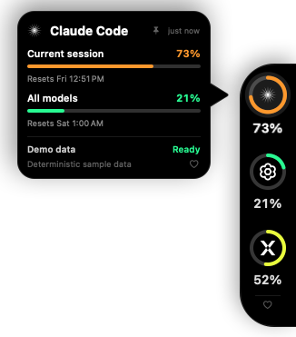
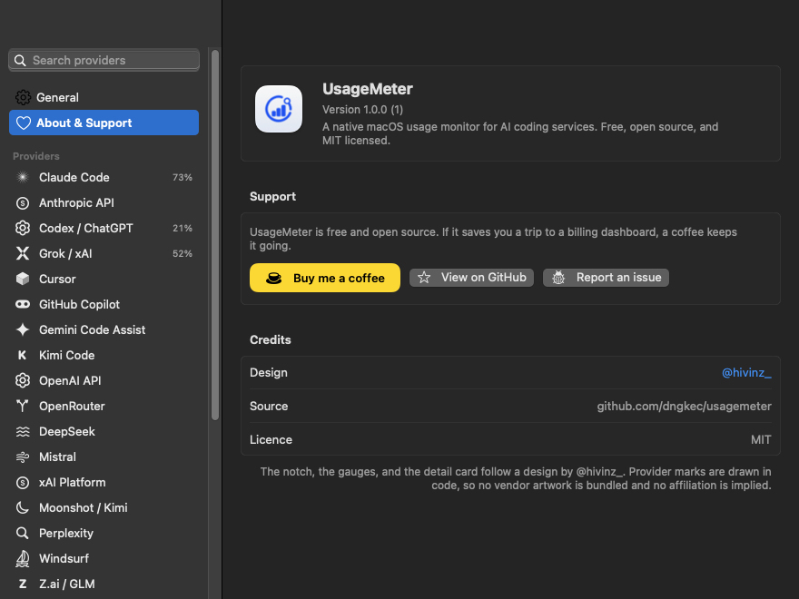

<div align="center">
  

  <h1>UsageMeter</h1>

  <p><strong>A native macOS usage monitor for every AI coding service you pay for.</strong></p>

  <p>
    
    
    
    <a href="https://buymeacoffee.com/dngkec"></a>
  </p>

  
</div>

UsageMeter is a native macOS 14+ usage monitor for AI coding services. Its primary interface is a true-black, always-on-top side notch attached to the right edge of a selected display. Hover a gauge to slide out its detail card — the card’s pointer aims at the gauge you are reading — click to pin it, and click away or press Escape to collapse it. After eight idle seconds the rail retreats to a slim tab.

The app is an `LSUIElement` accessory: it has no Dock icon and passive hover does not activate or focus the app. A small menu-bar gauge provides Refresh, Show/Hide, Settings, and Quit.

Everything it reads is read-only, every secret it owns lives in the Keychain, and it ships with no third-party runtime dependencies at all.

## Install

Download `UsageMeter-<version>.dmg` from [Releases](https://github.com/dngkec/usagemeter/releases), open it, and drag **UsageMeter** into **Applications**.

UsageMeter is ad-hoc signed rather than notarised, so macOS will not open it on the first try from a double-click. Right-click **UsageMeter.app** in Applications, choose **Open**, and confirm once. Every launch after that is normal. If you prefer the terminal:

```sh
xattr -dr com.apple.quarantine /Applications/UsageMeter.app
```

There is no Dock icon: look for the small gauge in the menu bar, and for the notch on the right edge of your display.

## Build from source

Requirements: macOS 14 or newer and Xcode or the Apple Command Line Tools with Swift 6. Either toolchain works — `Package.swift` detects which one is selected.

```sh
./scripts/build-app.sh          # dist/UsageMeter.app
open dist/UsageMeter.app

./scripts/make-dmg.sh           # dist/UsageMeter-<version>.dmg
```

All build products stay under `.build/`; the packaged, ad-hoc-signed app is written to `dist/UsageMeter.app`, and `make-dmg.sh` turns that into a drag-to-Applications disk image with the window laid out, a background, and a volume icon. Pass `--no-build` to package an app bundle you already have. The Finder arrangement is best-effort: on a machine that denies Finder automation — CI, most often — the image is still produced and valid, just not laid out.

To launch deterministic visual-test data with the first card expanded:

```sh
./scripts/run-demo.sh
```

Visual checks are scriptable. `scripts/capture-demo.sh` renders the overlay to `docs/usagemeter-demo.png` without needing screen-recording permission. `USAGEMETER_DEMO_PROVIDERS` picks which catalog entries appear, `USAGEMETER_SNAPSHOT_TARGET=settings` captures the Settings window instead of the notch, and `USAGEMETER_SNAPSHOT_PANE=about|general` chooses which pane it opens on.

## Interaction

- Hover a gauge for a forgiving preview. The card slides out beside it and its pointer aims at that gauge, so you always know which reading you are looking at.
- The card stays open while the pointer is on it, so its Dashboard and Settings links are reachable.
- Click a gauge to pin or unpin its card. Click away or press Escape to close a pinned card.
- A refresh dims each value arc and sweeps a white arc around it while the previous reading stays on screen. Percentages roll rather than jump.
- The menu-bar gauge mirrors the highest reading on show and lists every provider, alongside Buy Me a Coffee, the repository, and the designer.
- A quiet ♥ sits at the foot of the rail and on every card. It opens Buy Me a Coffee in your browser and does nothing else.
- Use Settings (`⌘,` from the menu-bar menu) to enable, hide, and search providers; set the overlay size; choose display and vertical placement; adjust refresh frequency; and configure launch at login. Changes apply as you make them. **About & Support** in the sidebar carries the version, the support links, and the credits.
- Reorder the rail by dragging in the sidebar, from a provider’s right-click menu, or with the arrows under **Position in the rail**.
- Reduce Motion is respected: transitions cross-fade, and the refresh sweep is replaced by a dimmed arc. The notch stays black in both system appearances, while Settings follows the system.

## Design

The overlay is proportioned from a single module — the rail width — so every measurement, including type, moves together. At the default Medium size:

| Element | Size |
|---|---|
| Rail | 72 pt wide, 44 pt leading corner radius, true black |
| Gauge | 46 pt with a 5 pt ring, arc drawn clockwise from twelve o’clock with round caps |
| Card | 248 pt wide, 22 pt corner radius, 26 × 30 pt pointer, 12 pt of air before the rail |
| Resting tab | 8 pt wide and 52 pt tall, inside a 24 pt pointer target |

Small and Large in Settings scale all of it by 0.86× and 1.18×.

Usage colour runs from `#14FF97` through `#EDFF05` to amber and red at 50%, 70%, and 90%.

Provider marks are drawn in code rather than bundled from vendors, so UsageMeter redistributes no third-party logo. To use official artwork, drop files into `Resources/ProviderMarks` and rebuild — see the README there. Anything not supplied keeps its drawn mark.

The overlay window is sized once per revealed session and grows before the panel opens, shrinking only after it has closed, so no window resize ever runs underneath an animation.

## Provider support

| Provider | Built-in live source | Credential behavior |
|---|---|---|
| Claude Code | `GET api.anthropic.com/api/oauth/usage` | Reads Claude Code Keychain item or `~/.claude/.credentials.json`; never refreshes or rewrites it. Extra usage is shown only when the account has it enabled. |
| Anthropic API | Organization cost report normalized to a monthly USD budget | Admin key is stored only in UsageMeter’s Keychain item. |
| Codex / ChatGPT | `GET chatgpt.com/backend-api/wham/usage` | Reads `~/.codex/auth.json`, including account header when present; never modifies it. Credits appear when the response includes them. |
| Grok / xAI | Both `cli-chat-proxy.grok.com/v1/billing` shapes | Reads `~/.grok/auth.json`; never modifies it. Credit balance is shown when present. |
| Cursor | `cursor.com/api/usage-summary`, then the per-user request count | Reads `state.vscdb` with `/usr/bin/sqlite3 -readonly`; no token is placed on the process command line. On-demand spend appears when enabled. |
| GitHub Copilot | `GET api.github.com/copilot_internal/user` | Discovers existing Copilot or GitHub CLI stores; never writes them. |
| Gemini Code Assist | Code Assist load/quota endpoints | Uses only a valid `~/.gemini/oauth_creds.json` access token. Reopen Gemini CLI after expiry. |
| Kimi Code | `GET api.kimi.com/coding/v1/usages` (request pool and rate-limit windows) | Uses only a valid `~/.kimi-code/credentials/kimi-code.json` access token. Reopen Kimi Code after expiry. |
| OpenAI API | Organization cost report normalized to a monthly USD budget | Admin key is stored only in UsageMeter’s Keychain item. |
| OpenRouter | `GET /api/v1/credits` and `GET /api/v1/key` | API key is stored only in UsageMeter’s Keychain item. Credits and a key cap are shown when the account has them. |
| DeepSeek | `GET api.deepseek.com/user/balance` | API key is stored only in UsageMeter’s Keychain item. Remaining credits are shown against your monthly budget. |
| Mistral | Organization spend limit (`GET /v1/admin/spend-limit`) | Admin key is stored only in UsageMeter’s Keychain item. |
| xAI Platform | `GET management-api.x.ai/v1/billing/teams/{team}/prepaid/balance` | Management key is stored only in UsageMeter’s Keychain item; the team ID goes in preferences. Inference keys are rejected by the API. |
| Moonshot / Kimi | `GET /v1/users/me/balance`, on the host for the chosen region | API key is stored only in UsageMeter’s Keychain item. Distinct from Kimi Code: different account, different key. |
| Z.ai / GLM | `GET /api/monitor/usage/quota/limit`, on the host for the chosen region | API key is stored only in UsageMeter’s Keychain item. Coding Plan windows are shown shortest-first; the MCP lane is listed separately. |
| OpenCode | `GET opencode.ai/zen/go/v1/usage` | API key is stored only in UsageMeter’s Keychain item. Resets are reported as a countdown and resolved against the time of the reading. |
| Warp | `POST app.warp.dev/graphql/v2?op=GetRequestLimitInfo` | API key is stored only in UsageMeter’s Keychain item. A plan with no request limit reports that rather than drawing an empty gauge. |
| JetBrains AI | The quota the IDE itself wrote to `AIAssistantQuotaManager2.xml` | No network request and no credential. The most recently updated IDE that has written a quota wins. |

Perplexity, Windsurf, Ollama/LM Studio, Amp, Kilo, Augment, Devin, Antigravity, and Custom are included in the catalog. UsageMeter does not guess at unsupported private APIs; in particular, providers that publish usage only to their own web app — Perplexity, Windsurf, Augment, Ollama’s cloud quota — are deliberately left to Custom JSON rather than importing browser cookies. Extra usage and credits still appear on a Custom JSON reading when the payload includes them. Every catalog entry supports:

- **Custom JSON**: GET/POST, HTTPS by default (localhost HTTP is permitted), optional bearer or API-key header secret in Keychain, dot-separated JSON paths for percentage or used/limit/reset, and an optional dashboard URL.
- **Manual Budget**: explicit used, limit, and reset date.

Demo Data is deterministic and labeled `DEMO DATA`; it is never silently substituted after a live error.

## Privacy and security

- Provider access is read-only. UsageMeter does not refresh or rotate shared CLI OAuth tokens.
- App-owned Admin/custom secrets use macOS Keychain, never the preferences file or logs.
- Preferences are an atomic JSON file at `~/Library/Application Support/UsageMeter/preferences.json`; it contains configuration but no secrets.
- Requests use ephemeral `URLSession`, system TLS defaults, 15-second request and 25-second resource timeouts, explicit endpoints, and a 1–2 MB response cap.
- Refreshes run concurrently and are cancellable. A failure is isolated to its provider.
- UsageMeter does not print credentials or provider response bodies.
- There are no Node or Python runtime dependencies and no third-party runtime frameworks.

Some discovered credentials may trigger a normal macOS Keychain access prompt. Denying it leaves that provider in Setup Needed without affecting the others.

## Verifying a build

```sh
swift build -c release
./scripts/build-app.sh
```

The release build is compiled with `-warnings-as-errors`, and the packaging script lints the bundle's `Info.plist` and verifies its signature with `codesign --deep --strict`.

Parsers, preferences and their migration, URL policy, connector modes, overlay geometry, bounded network failures, and concurrent refresh isolation are covered by a fixture-backed suite that is kept in the maintainer's working copy rather than published. `Package.swift` declares the test target only when `Tests/` is present, so this repository builds and packages without it.

## Troubleshooting

- **Setup Needed:** open the provider’s CLI/app and sign in, then Refresh. For catalog-only providers select Custom JSON or Manual Budget.
- **Expired Gemini/Kimi:** reopen the corresponding CLI. UsageMeter intentionally will not refresh its shared token.
- **Cursor unavailable:** quit/reopen Cursor once and confirm its account is signed in. UsageMeter reads the database in read-only mode.
- **Notch on the wrong display:** choose a named display in Settings. “Active display” follows the display containing the pointer when the panel is repositioned.
- **Launch at login fails:** run the packaged app from `/Applications`; ad-hoc development bundles can be rejected by ServiceManagement on some systems.
- **Demo snapshot:** `scripts/capture-demo.sh` renders the app’s own panel to `docs/usagemeter-demo.png`; it does not need Screen Recording permission.

## Support the project

UsageMeter is free and open source, and it will stay that way. If it saves you a
trip to a billing dashboard, you can
[**buy me a coffee**](https://buymeacoffee.com/dngkec) — it is the only thing the
app ever asks for, and it is what pays for the time that goes into it.

Starring the repository and reporting what breaks help just as much.



Every support surface is one click and leaves the app. The links live in one
place, [`Sources/UsageMeterCore/Support.swift`](Sources/UsageMeterCore/Support.swift),
and the app refuses to open any URL that is not one of them.

## Credits

- **Design** — [@hivinz_](https://x.com/hivinz_). The notch, the gauges, the
  detail card and its pointer, and the icon all follow their work. Please keep
  the credit if you fork this.
- **Code** — [@dngkec](https://github.com/dngkec) and
  [contributors](https://github.com/dngkec/usagemeter/graphs/contributors).
- Endpoint-shape research is credited in
  [THIRD_PARTY_NOTICES.md](THIRD_PARTY_NOTICES.md).

## Contributing

Read [CONTRIBUTING.md](CONTRIBUTING.md) first — it lists the five constraints the
app is built around, and how to add a provider. Security issues go through
[SECURITY.md](SECURITY.md) rather than a public issue.

## License

MIT. See [LICENSE](LICENSE) and [THIRD_PARTY_NOTICES.md](THIRD_PARTY_NOTICES.md).
